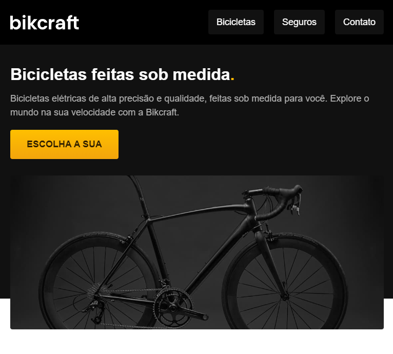
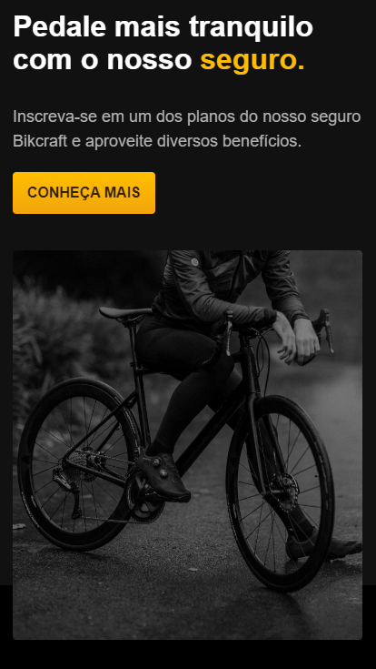

# Bikecraft

## Hospedado em: https://kelvi-pascoal-bikecraft.netlify.app/

### Projeto de estudo da Origamid, tecnologias abordadas:

- [HTML](https://developer.mozilla.org/pt-BR/docs/Web/HTML)
- [CSS](https://developer.mozilla.org/pt-BR/docs/Web/CSS)

## Projeto voltado as boas praticas de HTML/CSS e boas praticas:

### Semântica, Responsividade, Acessibilidade e mantendo um código de facil manutenção e componentizado.

|               |               |               |
| -------------------------------------- | ---------------------------------------- | ---------------------------------------- |
|              |              |              |
| ---                                    | ---                                      | ---                                      |
|            |            |            |
| ---                                    | ---                                      | ---                                      |
|  |  |  |
| ---                                    | ---                                      | ---                                      |
|             |             |             |
| ---                                    | ---                                      | ---                                      |
|        |        |        |
| ---                                    | ---                                      | ---                                      |
|             |             |             |
| ---                                    | ---                                      | ---                                      |
|       |       |       |
| ---                                    | ---                                      | ---                                      |
|          |          |          |
| ---                                    | ---                                      | ---                                      |
|          |          |          |
| ---                                    | ---                                      | ---                                      |
|       |       |       |
| ---                                    | ---                                      | ---                                      |
|          |          |          |
| ---                                    | ---                                      | ---                                      |
